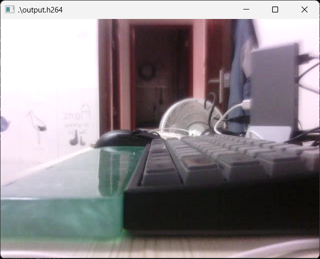

# TINY_V4L2_X264_PROJECT

## 项目概述

本项目调用libjson-c的接口来读取上层配置；然后调用v4l2接口，从底层拿到yuyv422数据；转成yuv420数据后，最后通过调用libx264接口将yuv420数据转换为H264视频帧，保存到文件中。存取完毕后，将文件从板端复制到windows端，通过`ffplay`查看 图像效果,如下图所示：



开发语言： `C`

编译系统： `Make`

用到的开源库
* [libjson-c](https://github.com/json-c/json-c)
* [libx264](https://www.videolan.org/developers/x264.html)

其中，libjson-c的版本为`0.11`，配置选项为：
```
./configure --prefix=$PWD/build --enable-shared=yes --enable-static=yes --host=arm-linux-gnueabihf
```

libx264的版本为`0.164.x`，配置选项为：
```
./configure --prefix=$PWD/build --enable-static --cross-prefix=arm-linux-gnueabihf- --host=arm-linux --disable-opencl --enable-pic --disable-asm
```

## 配置文件

目前项目有两个配置文件，它们均位于`src/configs`路径下

### compile.config

顾名思义，这个文件指定了编译、安装时会用到的一些配置。可以通过修改这个配置来设置程序运行时的log等级，交叉编译工具链、可执行文件以及配置安装路径等内容

### video.json

这个json文件中的配置可以分为两部分

第一部分定义了sensor在v4l2框架下的“能力”（即支持的像素格式、分辨率、帧率等），目前该项目只测试过ov5640这颗sensor，后续有需要的话可以继续更新

第二部分定义了当前程序运行时的出流配置，需要注意的是，这部分配置需要与第一部分的sensor配置兼容（比如说，ov5640不支持`2560*1440`，那么流的分辨率就不能设为`2560*1440`），否则程序会终止运行

## 开发环境搭建 && 编译方法

本项目基于正点原子的**i.MX6ULL Linux阿尔法开发板**进行开发，选用的sensor是**ov5640**。

虚拟机镜像使用的是正点原子打包好的ubuntu镜像（[下载链接](http://www.openedv.com/docs/boards/arm-linux/zdyz-i.mx6ull.html)）

板端运行的固件也是正点原子提供的（试过使用自己构建的文件系统，发现v4l2驱动不能正常运行，可能只有正点原子提供的固件有适配），下载链接同上

上述开发环境搭建完毕后，将本项目复制到虚拟机内，修改`compile.config`和`video.json`，修改完成后，执行

```
make && make install
```

即可编译出可执行文件

然后，板端上电运行，通过`tftp`把可执行文件和配置传过来，直接运行即可生成h264文件

```
./tiny_video_program
```

## 参考文件

该项目在编写过程中参考了一些文件，统一放到`./reference`路径下，留作记录

## 可以 改进 && 优化 的点

1. 目前还是通过复制文件到windows系统的方式来查看图像效果，后续可以使用`live555`来构建一个rtsp服务器，windows直接使用vlc来预览，这就很方便了
2. 目前x264编码还是比较慢。因为不太熟悉开发板的硬件架构，所以编译x264时把所有的硬件级优化、汇编优化都关掉了，后续可以看下能不能开启部分选项来加速编码


